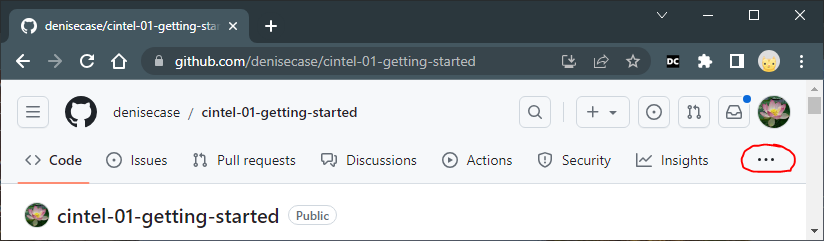
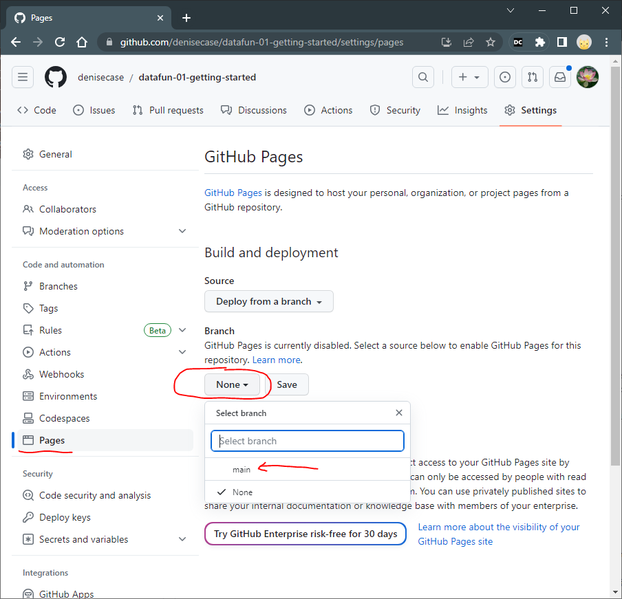
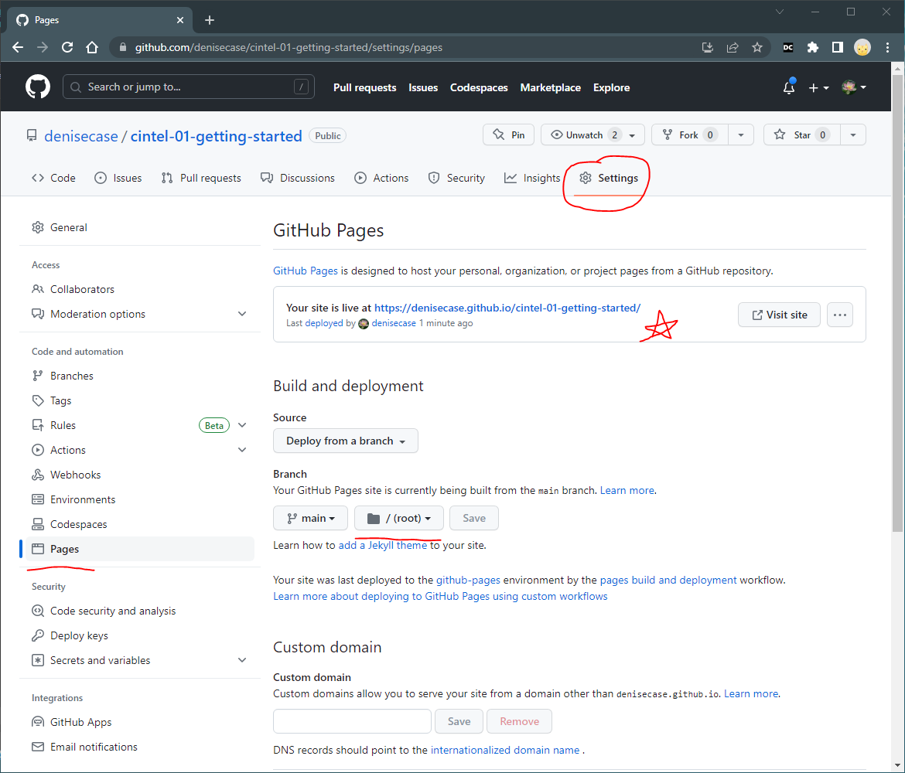

# Publishing to GitHub Pages

To publish your website to GitHub Pages, follow these steps.

## 1. Set Up GitHub Pages

1. Go to your forked repository on GitHub.
2. Click on the "Settings" tab. You may have to click the three dots - It's all the way to the right. See Screenshots below.
3. Scroll down and click the "GitHub Pages" section.
4. Under the "Source" dropdown, select the branch you want to publish (e.g., "main").
5. Click on the "Save" button.

Example: Finding Settings tab

Example: Setting the Source

## 2. Access Your Published Website

1. Once you've saved the GitHub Pages settings, scroll back down to the "GitHub Pages" section.
2. You will see a message indicating that your site is published. It will provide you with the URL for your published website (e.g., `https://your-github-username.github.io/your-repository-name/`).
3. Click on the URL to visit your published website and verify that it's working correctly.

## 3. Update Your Website

If you make changes to your code and want to update your published website:

1. Open VS Code and make the necessary changes to your code.
2. In VS Code, find the "Source Control" icon and click it.
3. Enter a brief commit message describing your changes.
4. Change the "Commit" button dropdown to "Commit and Push" to send your changes back to GitHub.
5. GitHub will automatically rebuild and update your published website with the latest changes.

Example: Link to Deployed App in GitHub Pages

